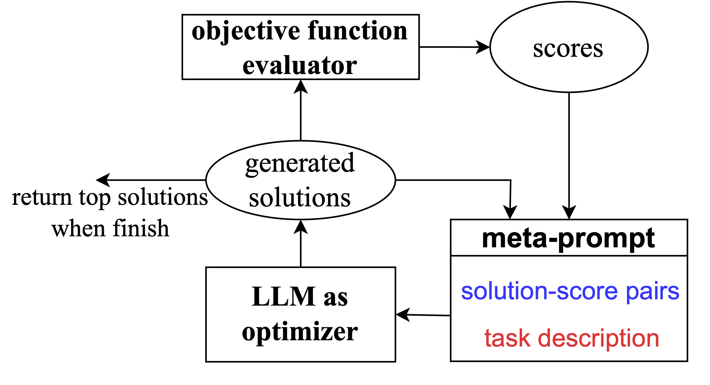
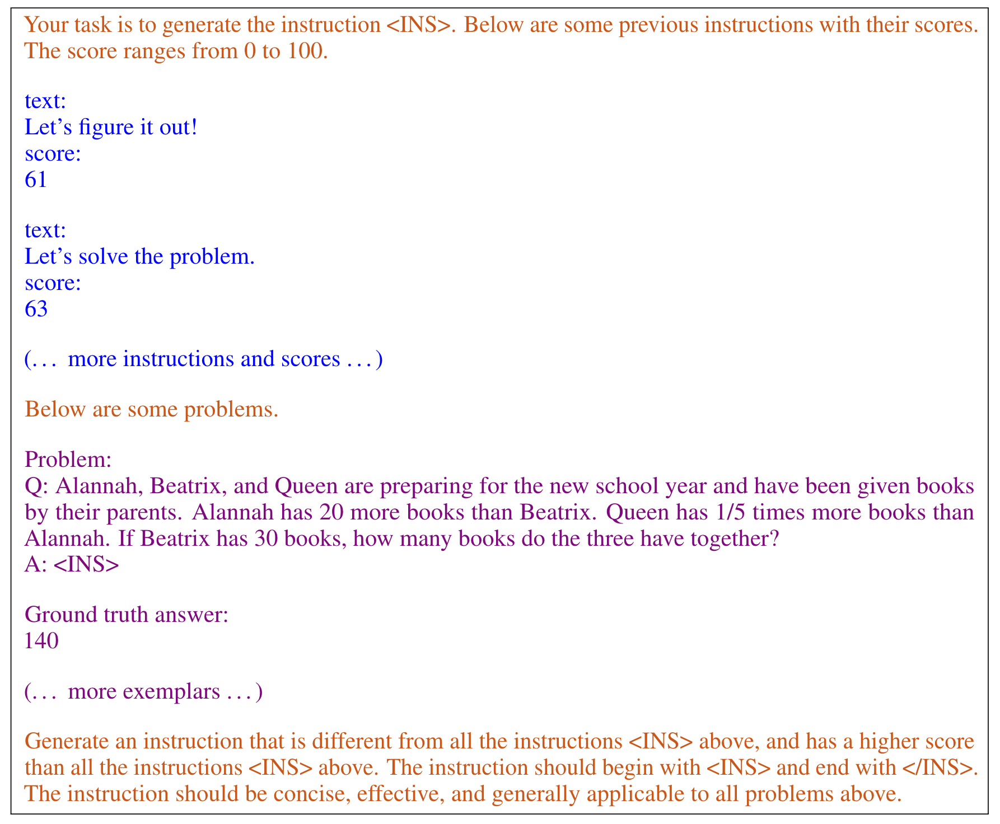

# Large Language Models as Optimizers

This repository contains the code for the paper

> [Large Language Models as Optimizers](https://arxiv.org/abs/2309.03409)\
> Chengrun Yang*, Xuezhi Wang, Yifeng Lu, Hanxiao Liu, Quoc V. Le, Denny Zhou, Xinyun Chen* [* Equal Contribution]\
> _arXiv: 2309.03409_

<p align="center">
  &nbsp;&nbsp;&nbsp;&nbsp;&nbsp;&nbsp;&nbsp;&nbsp;
  
</p>

## Dependency requirements

The code has been verified to work under `Python 3.10.13` with the following dependencies:

```
- absl-py (2.0.0)
- google.generativeai (0.1.0)
- immutabledict (3.0.0)
- openai (0.27.2)
```

## Usage

### Prompt optimization 
Use `opro/optimization/optimize_instructions.py`, follow the steps at the top. 

A quickstarter:

`
python optimize_instructions.py --optimizer="gpt-3.5-turbo" --scorer="text-bison"
--instruction_pos="Q_begin" --dataset="gsm8k" --task="train" --palm_api_key="<your_palm_api_key>" --openai_api_key="<your_openai_api_key>"
`

### Prompt evaluation
Use `opro/evaluation/evaluate_instructions.py`, follow the steps at the top.

A quickstarter:

`
python evaluate_instructions.py --scorer="text-bison" --dataset="gsm8k" --task="test" --instruction_pos="Q_begin" --evaluate_training_fold=false --evaluate_test_fold=true --palm_api_key="<your_palm_api_key>"
`

### Linear regression
Use `opro/optimization/optimize_linear_regression.py`, follow the steps at the top.


### Traveling salesman problem
Use `opro/optimization/optimize_tsp.py`, follow the steps at the top.


## Supported models

The code in this repository currently supports [text-bison](https://cloud.google.com/vertex-ai/docs/generative-ai/model-reference/text) and [GPT models](https://platform.openai.com/docs/api-reference/introduction). Alternatively, you may serve your own model and plug it in here, similar to the existing prompting APIs in `opro/prompt_utils.py`.


## Precaution on API costs

Calling the PaLM or GPT APIs for prompt optimization and evaluation may incur unexpectedly large costs. Please carefully estimate the cost and/or start with lighter use (e.g., evaluate on a smaller portion of the benchmark dataset or run optimization for fewer steps) before the formal experimentations, or prompt self-served models instead.

## Citation

If you have used our code in your research, please cite our [paper](https://arxiv.org/abs/2309.03409):

```
@article{yang2023large,
  title={Large language models as optimizers},
  author={Yang, Chengrun and Wang, Xuezhi and Lu, Yifeng and Liu, Hanxiao and Le, Quoc V and Zhou, Denny and Chen, Xinyun},
  journal={arXiv preprint arXiv:2309.03409},
  year={2023}
}
```


*Disclaimer: this is not an officially supported Google product.*

